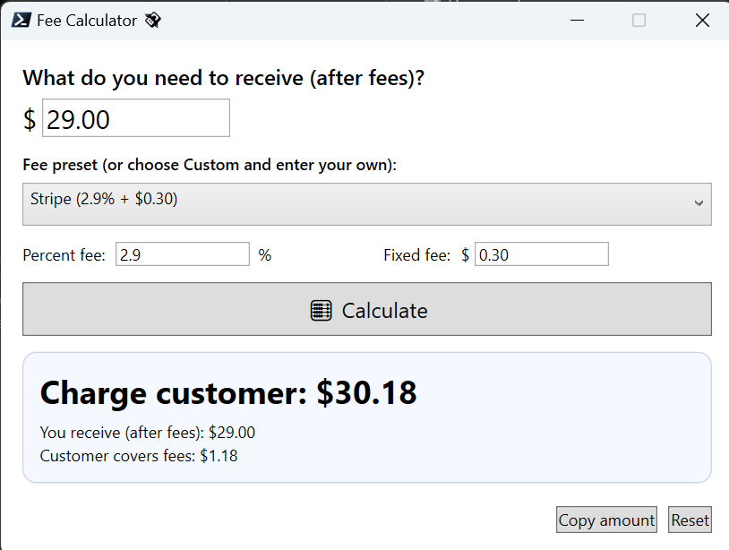

# 💸 Fee Calculator (PowerShell WPF)

A simple offline Windows PowerShell WPF application that helps you calculate how much to charge your customer so that, after processor fees, you receive the exact amount you need.

This is handy for platforms like Stripe, Square, PayPal, or Venmo, where transaction fees are a combination of a **percentage fee + fixed fee**.

---

## 📸 Screenshot



---

## 🚀 Features

- Enter the **net amount** you want to receive.
- Choose a **preset** (Stripe, Square, PayPal, Venmo) or set custom fees.
- Automatically calculates the **gross charge** the customer must pay.
- Always **rounds up** to the nearest cent, so you never come up short.
- One-click **copy to clipboard** for the final amount.
- Fully **offline**, no network required.

---

## ⚙️ Installation

1. Save the script as `FeeCalcUp.ps1`.
2. Right-click → **Run with PowerShell**  
   or run from terminal:  
   ```powershell
   powershell -ExecutionPolicy Bypass -File .\FeeCalc.ps1
   ```

---

## 🧮 Example

If you need **$29.00** net with **2.9% + $0.30** Stripe fees:

- The app will calculate:  
  - **Charge customer:** $30.18  
  - **You receive:** $29.00  
  - **Customer covers fees:** $1.18  

---

## 📝 Notes

- Default presets are based on standard U.S. rates:
  - Stripe: **2.9% + $0.30**  
  - Square Online: **2.9% + $0.30**  
  - PayPal Checkout: **3.49% + $0.49**  
  - Venmo Business: **1.9% + $0.10**  
- If your processor uses different rates, just select **Custom** and enter your own.

---

## 📄 License

MIT License — free to use and modify.
